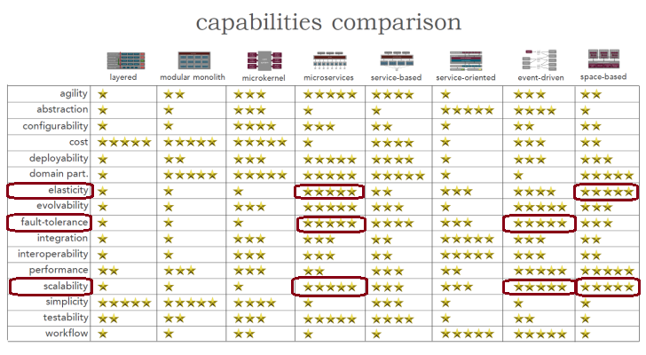
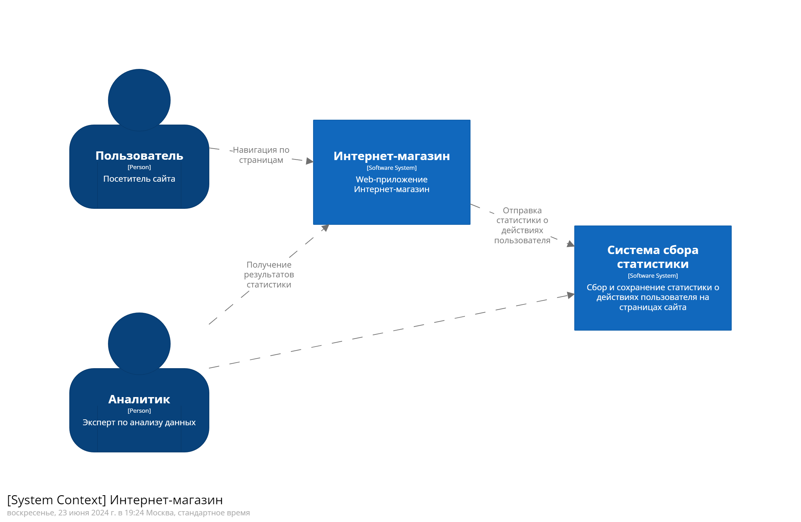
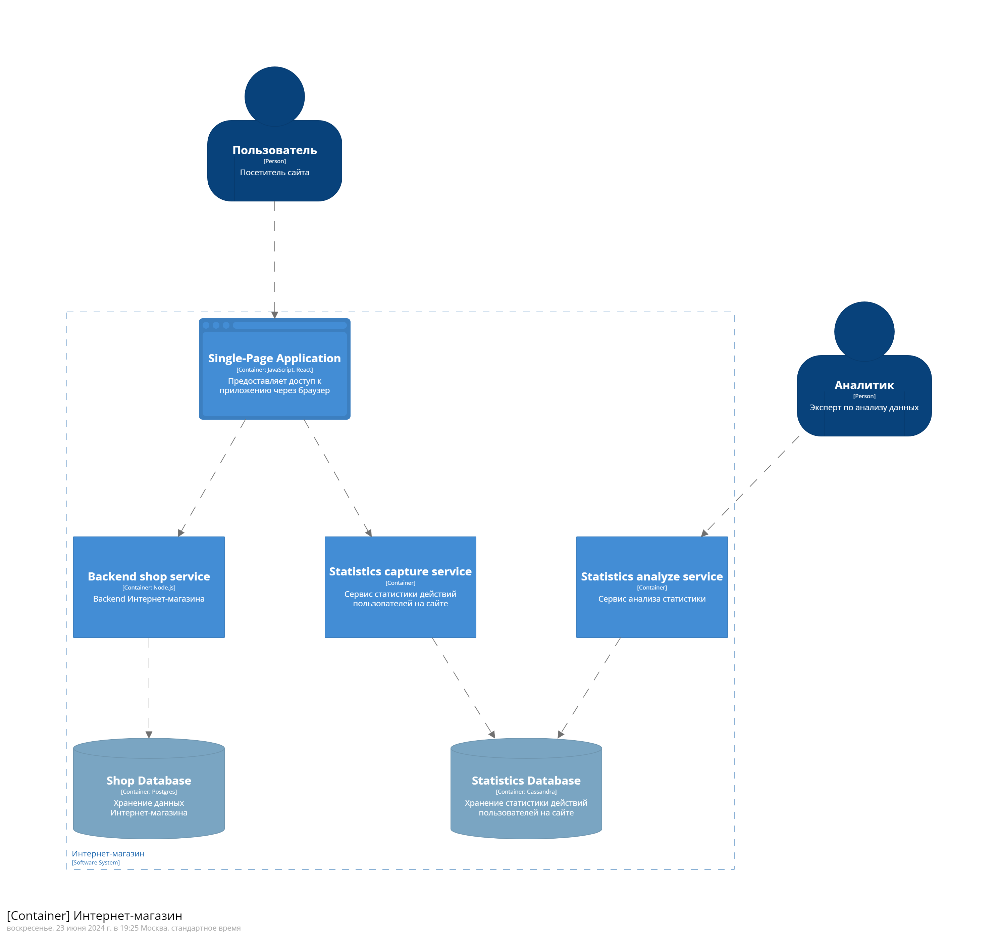
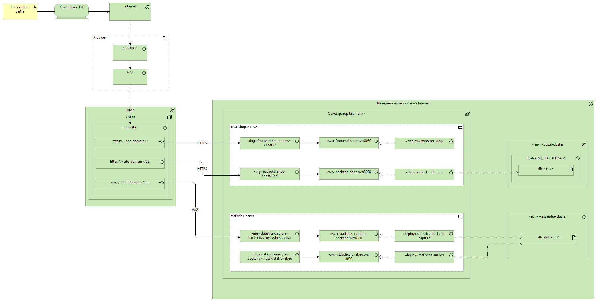
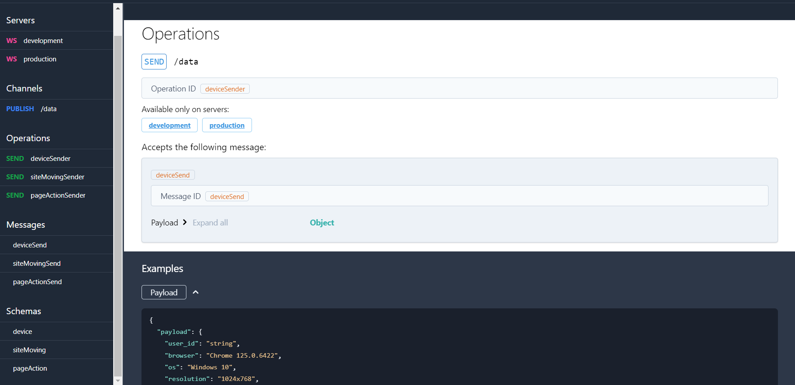

# Разминочная задача

Имеется web-приложение интернет-магазина, реализованное с использованием популярных технологий (например, NodeJS+React).
Руководитель проекта поручил повысить позиции сайта в результирующих выборках поисковых сервисов. Для этого необходимо
предоставить возможность сбора и анализа статистики посещения web-страниц приложения

[Полное описание задачи](./Problem.md)

## Бизнес цель
Улучшение позиций в поисковой выдаче

## Функциональные требования
- Возможность сбора статистики посещения пользователями web-страниц приложения
- Возможность анализа собранной статистики

## Нефункциональные требования
- Возможность горизонтального масштабирования
- Возможность горячего резервирования компонентов приложения для обеспечения отказоустойчивой работы
- Равномерное распределение потоков запросов между обработчиками

## Анализ сторонних решений
В качестве сторонних решений могут быть использованы:
- Яндекс.Метрика
- Google.Analytics

**Преимущества** данных систем:
- Легкий способ подключения к веб-ресурсу
- Широкий набор собираемых данных для анализа

**Недостатки** данных систем:
- Данные хранятся у стороннего оператора (Яндекс, Google)
- Нет возможности выгрузки данных для анализа за большой период
- Нет гибкой настройки по сбору данных

## Описание архитектурных характеристик и выбор архитектуры
Исходя из нефункциональных требований были выбраны 3 главные архитектурные характеристики для реализации системы:

- Эластичность (elasticity) - Система способна расширяться и быстро реагировать на неожиданные или ожидаемые
  экстремальные нагрузки (например, мгновенное увеличение числа пользователей от 20 до 250 000)
- Отказоустойчивость (fault tolerance) - При возникновении фатальных ошибок другие части системы продолжают
  функционировать
- Масштабируемость (scalability) - Функция емкости системы и ее роста с течением времени; по мере увеличения количества
  пользователей или запросов в системе скорость реагирования, производительность и частота ошибок остаются постоянными

Наиболее подходящим решением является **микросервисная архитектура**.

## Общий взгляд на решение
Поведение пользователя:
- Пользователь посещает страницу онлайн-магазина
- Пользователь переходит по ссылкам внутри онлайн магазина

Система сбора статистики должна:
- Сохранять путь пользователя по страницам от точки входа, до точки выхода
- Запоминать время пребывания на странице
- Определять на чем сфокусировано внимание пользователя, учитывая действия пользователя на конкретной странице (движение мыши, скроллинг страницы)

## Решение

### Контекстная диаграмма модели C4

### Контейнерная диаграмма модели C4

### Диаграмма развертывания

### ADR
Для выбора оптимального решения подготовлен список ADR:
- Использование Cassandra для хранения данных статистики
- Взаимодействие с сервисом статистики по протоколу WebSocket

### Модель данных для хранения статистики

**Таблица Device**

Характеристики, настройки устройства и браузера пользователя

| Поле | Тип данных | Описание
| --- | --- | ---
| user_id | text | Уникальный идентификатор
| browser | text | Браузер и версия
| os | text | Операционная система
| resolution | text | Разрешение экрана
| ip | text | IP адрес

**Таблица SiteMoving**

Перемещение пользователя по страницам сайта

| Поле | Тип данных | Описание
| --- | --- | --- 
| user_id | text | Уникальный идентификатор
| url | text | URL страницы
| create_time | datetime | Начало время посещения страницы

**Таблица PageAction**

Поведение пользователя на странице

| Поле | Тип данных | Описание
| --- | --- | --- 
| user_id | text | Уникальный идентификатор
| url | text | URL страницы
| create_time | datetime | Начало время совершения действия
| element_selector | text | id или селектор элемента на котором сосредоточен пользователь 

### Описание API

Для сбора статистики используется WebSocket API.
Endpoint-ы описаны с помощью AsyncApi.

Операции:
- deviceSender - отправка данных об устройстве, браузере и настройках пользователя
- siteMovingSender - отправка данных о посещении страниц пользователем
- pageActionSender - отправка данных о навигации пользователем по элементам страницы

