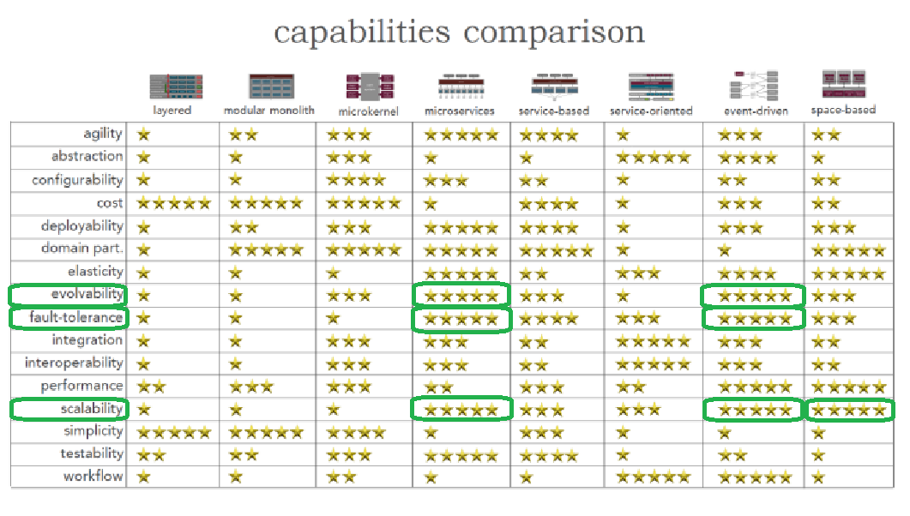

# Архитектурные характеристики

Исходя из нефункциональных требований были выбраны 3 главные архитектурные характеристики для реализации системы:

- Отказоустойчивость (fault tolerance) - При возникновении фатальных ошибок другие части системы продолжают
  функционировать
- Масштабируемость (scalability) - Функция емкости системы и ее роста с течением времени; по мере увеличения количества
  пользователей или запросов в системе скорость реагирования, производительность и частота ошибок остаются постоянными
- Возможностью развития/Эволюционируемость (evolvability) - Система способна эволюционировать, быстро изменяться под нужды бизнеса. Компоненты системы имеют возможность непрерывной доставки.

Наиболее подходящим решением является **микросервисная архитектура с элементами event-driven архитектуры**.