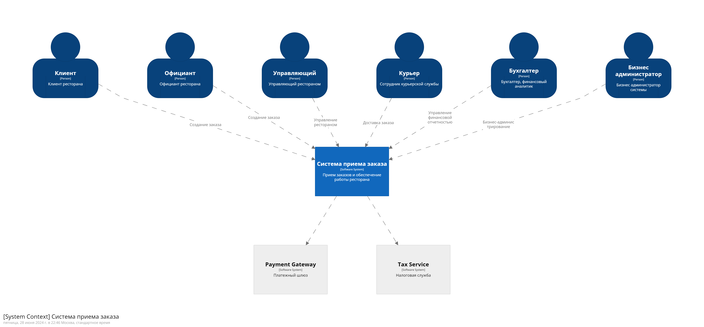
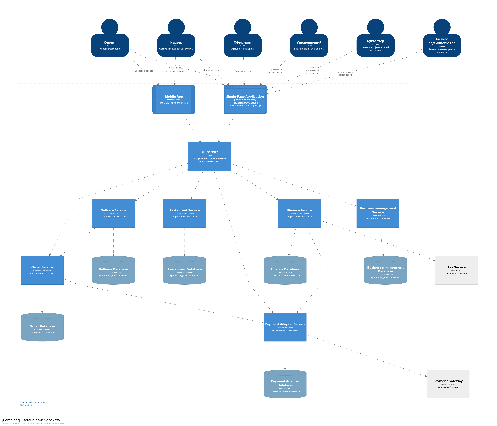

# Архитектурные характеристики

## Контекстная диаграмма модели C4

Уровень C1 (Context view) в модели C4, представляет общий вид системы, ее внешние взаимодействия и зависимости.
Диаграмма изображает систему как единое целое, окруженное внешними субъектами, системами.

## Контейнерная диаграмма модели C4

Уровень C2 (Container view) в модели C4, углубляется во внутренние компоненты системы, демонстрируя различные контейнеры или модули приложений и их взаимосвязи. Он предоставляет подробное описание внутренней структуры системы, включая различные типы контейнеров, таких как службы, базы данных, пользовательские и внешние интерфейсы. Такое представление позволяет заинтересованным сторонам понять внутреннюю архитектуру системы и то, как ее компоненты взаимодействуют для выполнения своих функций.

Ресурсы:
- [Исходник диаграммы C4 для Structurizr](./resources/c4.dsl)
- [Интерпретатор DSL - Structurizr](https://structurizr.com/dsl)
