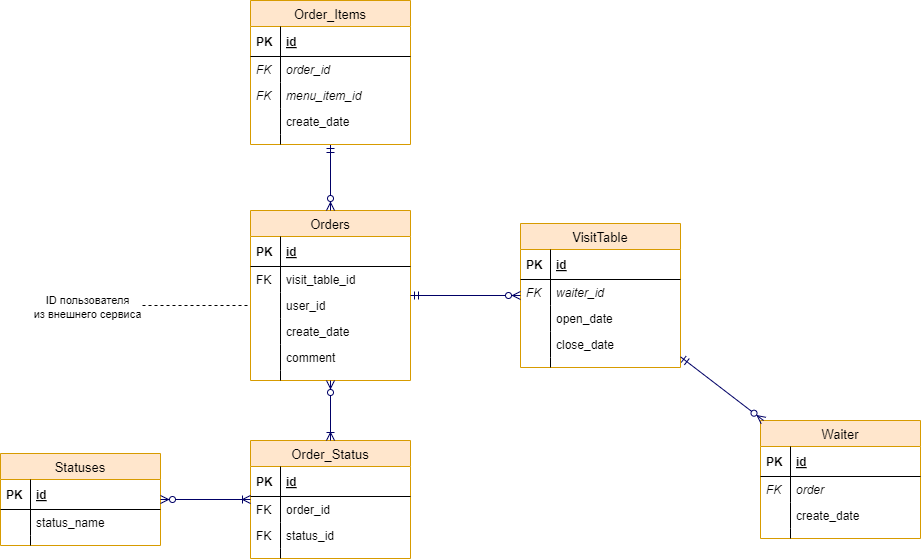

# Модель данных и описание API

Протоколы для взаимодействия:
- HTTP/REST (взаимодействие пользователей с сайтом, взаимодействие между сервисами)
- WebSocket (оповещение пользователей и сотрудников)
- TCP/Kafka (взаимодействие между сервисами)

## Описание OpenAPI

## ER-модель данных сервиса заказов

